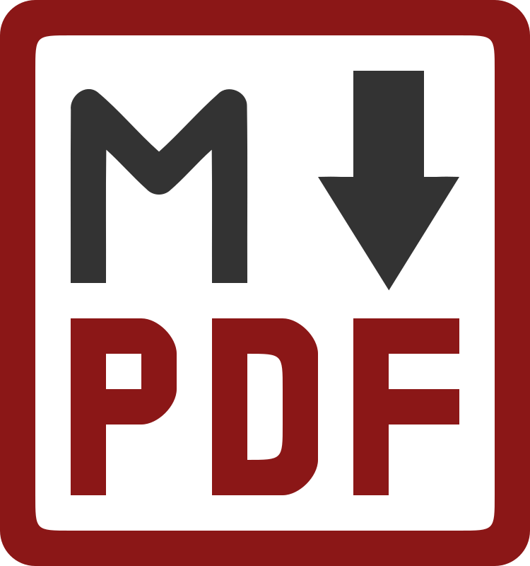

# md-pdf

A fast, lightweight command-line tool that converts Markdown files to professional PDF documents using [Typst](https://typst.app).



## Features

- 🚀 **Fast conversion** powered by Typst
- 🎨 **Professional output** with built-in templates
- ⚙️ **Zero configuration** - works out of the box
- 👀 **Watch mode** for live preview
- 🔗 **Link validation** checks external URLs
- 📝 **Rich metadata** support via YAML front matter

## Installation

### Prerequisites

### Typst

Install [Typst CLI](https://github.com/typst/typst):

```bash
# macOS
brew install typst

# Or download from GitHub releases
# https://github.com/typst/typst/releases
```

### Fonts

The default template `simple` uses some fonts which are optional.

Install [Iosevka](https://typeof.net/Iosevka/)

### Install md-pdf

```bash
# From source
cargo install --git https://github.com/tschinz/md-pdf

# Or build locally
git clone https://github.com/tschinz/md-pdf
cd md-pdf && cargo install --path .
```

## Quick Start

```bash
# Convert markdown to PDF
md-pdf document.md

# Watch for changes (live preview)
md-pdf --watch document.md

# Check links before conversion
md-pdf --check-links document.md

# Use specific template
md-pdf document.md -t simple
```

## Usage

```
md-pdf [OPTIONS] <INPUT>

Options:
  -o, --output <FILE>       Output PDF file
  -t, --template <NAME>     Template to use [default: none]
  -w, --watch               Watch for changes and rebuild
      --check-links         Validate external links
      --list-templates      Show available templates
      --show-config         Show configuration
  -h, --help               Print help
```

## Templates

- `none` - Minimal styling (default)
- `simple` - Professional with headers/footers
- You can add you own templates

## Front Matter

Add metadata to your markdown:

```yaml
---
title: "My Document"
author: "Your Name"
date: "2026-01-23"
template: "simple"
toc: true
---
# Content starts here
```

## Configuration

Auto-created at `~/.config/md-pdf/config.ron` on first run. Customize defaults:

```rust
(
    templates_dir: Some("/Users/username/.config/md-pdf/templates"),
    default_template: Some("simple"),
    default_author: Some("Your Name"),
    default_language: Some("en"),
    default_toc: Some(true),
)
```

## Examples

See [`examples/comprehensive-guide.md`](examples/comprehensive-guide.md) for full documentation and feature demonstrations.

```
md-pdf example/comprehensive-guide.md
```
