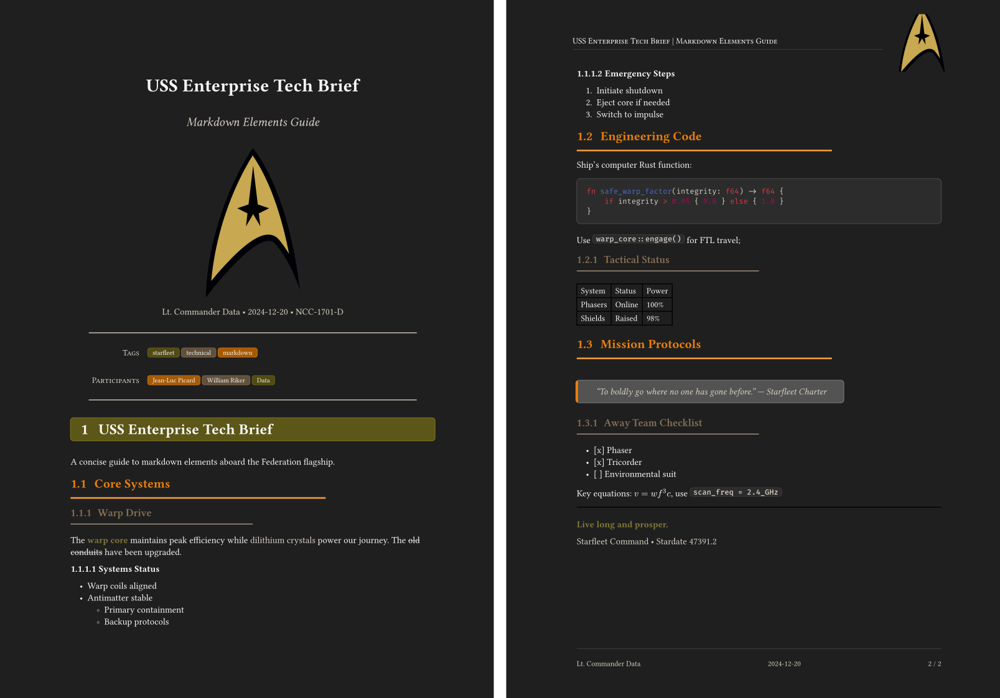

<div align="center">
  
</div>

# md-pdf

A fast, lightweight command-line tool that converts Markdown files to professional PDF documents using [Typst](https://typst.app).

## Features

- 🚀 **Fast conversion** powered by Typst
- 🎨 **Professional output** with built-in templates
- ⚙️ **Zero configuration** - works out of the box
- 👀 **Watch mode** for live preview
- 📂 **Auto-open** generated PDFs
- 🔗 **Link validation** checks external URLs
- 📝 **Rich metadata** support via YAML front matter

## Installation

### Prerequisites

### Typst

Install [Typst CLI](https://github.com/typst/typst):

```bash
# macOS
brew install typst

# Or download from GitHub releases
# https://github.com/typst/typst/releases
```

### Fonts

The default template `simple` uses some fonts which are optional.

Install [Iosevka](https://typeof.net/Iosevka/)

### Install md-pdf

```bash
# From source
cargo install --git https://github.com/tschinz/md-pdf

# Or build locally
git clone https://github.com/tschinz/md-pdf
cd md-pdf && cargo install --path .
```

## Quick Start

```bash
# Convert markdown to PDF
md-pdf document.md

# Convert and open PDF automatically
md-pdf document.md --open

# Watch for changes (live preview)
md-pdf --watch document.md

# Watch for changes and open PDF after each rebuild
md-pdf --watch document.md --open

# Check links before conversion
md-pdf --check-links document.md

# Use specific template
md-pdf document.md -t none
md-pdf document.md -t simple
md-pdf document.md -t playful
md-pdf document.md -t brutalist
md-pdf document.md -t darko
```

## Usage

```
Convert markdown files to PDF using typst with templating

Usage: md-pdf [OPTIONS] [INPUT]

Arguments:
  [INPUT]  Path to the input Markdown file

Options:
  -o, --output <OUTPUT>      Path to the output PDF file
  -t, --template <TEMPLATE>  list the templates and select the one you want [default: none]
  -w, --watch                Watch the input file for changes and rebuild automatically
      --check-links          Check all links in the markdown file and display warnings for unreachable links
      --list-templates       List all available templates
      --create-config        Create default configuration file
      --show-config          Show configuration file locations and settings
      --open                 Open the generated PDF file after creation
  -h, --help                 Print help
  -V, --version              Print version
```

## Templates

- `none` - Minimal styling (default)
  
- `simple` - Professional with headers/footers
  
- `playful` - colorful inspired by Dieter Rams
  
- `brutalist` - Raw, bold, stark design with high contrast
  
- `darko` - May the dark side be with you
  
- You can add you own templates

## Front Matter

Add metadata to your markdown, all elements are optional:

```yaml
---
title: "My Document"
subtitle: "Subtitle"
logo: "path/to/logo.png"
author: "Your Name"
date: "2026-01-23"
version: "0.0.1"
language: "en"
toc: true
tags: ["tag1", "tag2"]
participants: ["Participant1", "Participant2"]
template: "simple"
---
# Content starts here
```

## Configuration

Auto-created at `~/.config/md-pdf/config.ron` on first run. Customize defaults:

```rust
(
    templates_dir: Some("/Users/username/.config/md-pdf/templates"),
    default_template: Some("simple"),
    default_author: Some("Your Name"),
    default_language: Some("en"),
    default_toc: Some(true),
)
```

## Examples

See [`examples/comprehensive-guide.md`](examples/comprehensive-guide.md) for full documentation and feature demonstrations.

```
md-pdf example/comprehensive-guide.md
```

> Rustdoc AI generated
