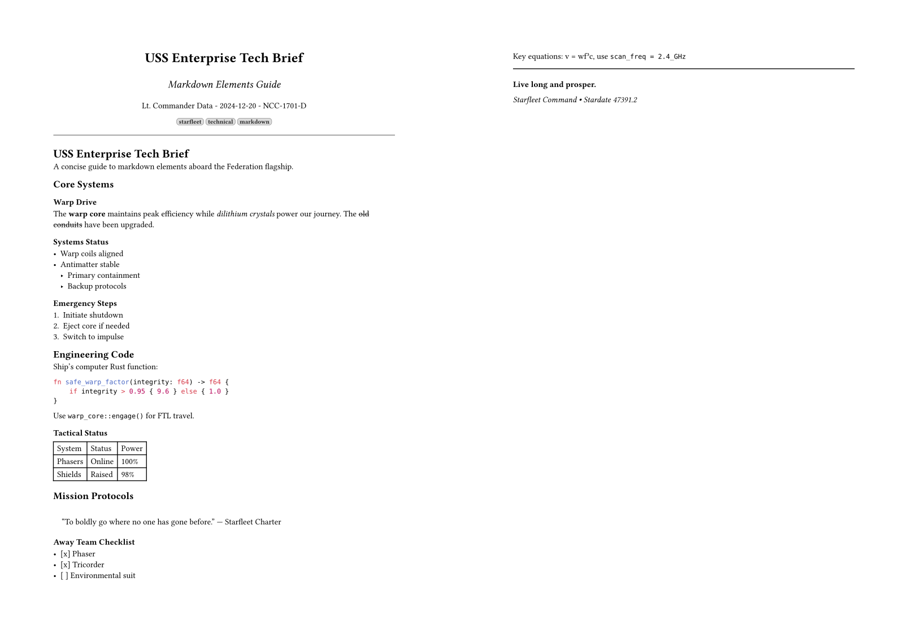
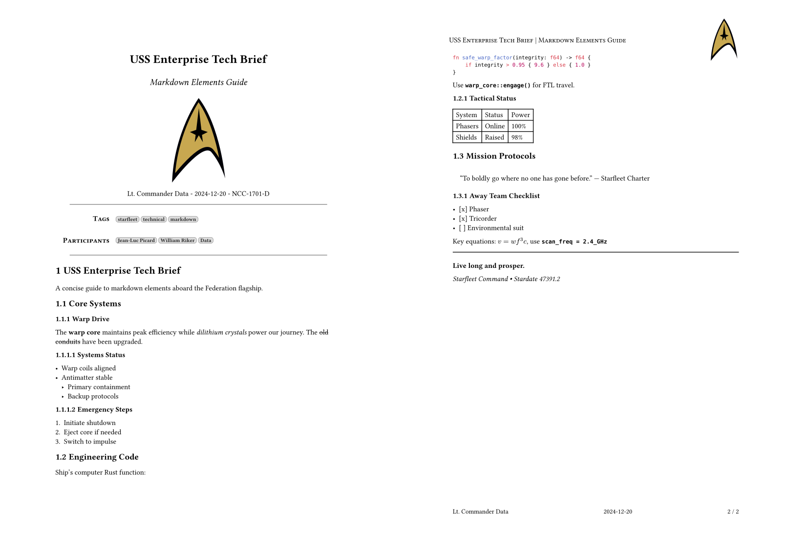
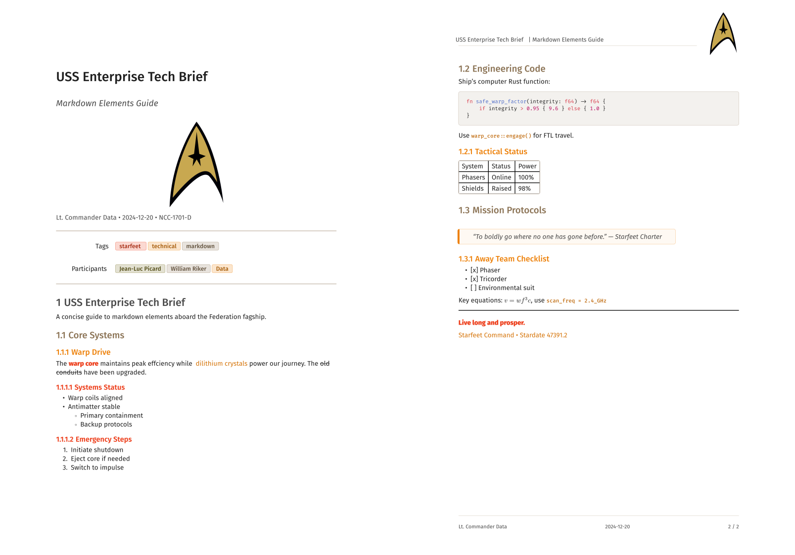
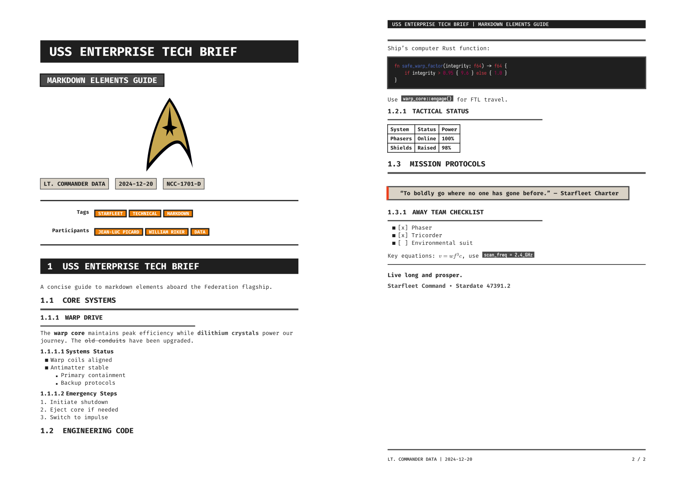

# Overview

**md-pdf** is a powerful, lightweight command-line tool that converts Markdown files into professional PDF documents. Built with Rust and powered by the Typst typesetting system, it provides fast, high-quality document generation.

md-pdf bridges the gap between Markdown's simplicity and PDF's professional presentation. It's designed for developers, writers, researchers, and anyone who needs to create beautiful documents from Markdown source files.


## Key Benefits

- 🚀 **Lightning Fast**: PDF generated with Typst, minimal installation footprint
- 🎨 **Professional Output**: High-quality typography and layout
- ⚙️ **Zero Configuration**: Works out of the box with intelligent defaults
- 🔧 **Highly Customizable**: Flexible template system and configuration options
- 👀 **Live Preview**: Real-time PDF updates with watch mode
- 🔗 **Link Validation**: Built-in checking for external links to ensure document quality
- 📝 **Rich Metadata**: Comprehensive front matter support

# Installation

## Prerequisites

Before installing md-pdf, you need:

### Rust Toolchain (Optional, for building from source)

If you plan to build from source:

```bash
# Install rustup if needed
curl --proto '=https' --tlsv1.2 -sSf https://sh.rustup.rs | sh

# Restart shell or source the environment
source $HOME/.cargo/env

# Verify installation
rustc --version
cargo --version
```

Visit [rust-lang.org](https://www.rust-lang.org/tools/install) for more details.

### Typst CLI (Required)

Typst is the typesetting engine that powers PDF generation:

```bash
# Install via cargo (recommended)
cargo install typst-cli

# Verify installation
typst --version
```

Visit [typst.app](https://typst.app/) for more details.

### Fonts (optional)

Some templates using custom fonts. If they are not installed a fallback will be used.

- [Fira Sans and Fira Mono](https://github.com/mozilla/Fira)
- [Iosevka](https://typeof.net/Iosevka/)

## Installing md-pdf

Install directly from the Git repository using cargo:

```bash
# Install latest stable release
cargo install --git https://github.com/tschinz/md-pdf

# Install specific version/tag
cargo install --git https://github.com/tschinz/md-pdf --tag v0.0.1
```

### First Run & Auto-Setup

After installation, md-pdf is ready to use immediately:

```bash
# Convert your first document (triggers auto-setup)
md-pdf README.md

# Check what was automatically created
md-pdf --show-config

# List available templates
md-pdf --list-templates
```

On first run, md-pdf automatically creates:

- **Configuration file**: `~/.config/md-pdf/config.ron`
- **Templates directory**: `~/.config/md-pdf/templates/`
- **Template files**: `none.typ` and `simple.typ`

### Verification

Verify your installation works correctly:

```bash
# Check version
md-pdf --version

# Test conversion with a simple document
echo "# Test Document" > test.md
echo "This is a test." >> test.md
md-pdf test.md

# Check if PDF was created
ls -la test.pdf
```

# Configuration System

md-pdf uses a sophisticated configuration system that provides intelligent defaults while allowing complete customization.

## Auto-Configuration

The tool automatically configures itself on first use:

- Creates a configuration file with sensible defaults
- Sets up a templates directory with proper paths
- Installs basic template files with full content
- No manual setup required!

## Creating Configuration Files

### Automatic Creation

Configuration is created automatically on first use, but you can manually create it:

```bash
# Create default configuration file
md-pdf --create-config
```

This creates `~/.config/md-pdf/config.ron` with:

- Proper templates directory path
- Sensible defaults for all options
- Complete template files (none.typ and simple.typ)
- Detailed comments explaining each option

### Manual Configuration

You can also create configurations in specific locations:

```bash
# Project-specific configuration
echo '(default_template: Some("custom"))' > ./md-pdf.ron

# User-specific override
mkdir -p ~/.config/md-pdf
md-pdf --create-config
```

## Configuration File Locations

md-pdf searches for configuration files in this priority order:

1. **`./md-pdf.ron`** - Project-specific configuration (highest priority)
2. **`<binary-dir>/md-pdf.ron`** - Portable installation configuration
3. **`~/md-pdf.ron`** - User home directory
4. **`~/.config/md-pdf.ron`** - XDG standard location
5. **`~/.config/md-pdf/config.ron`** - **Recommended default location**
6. **`~/.config/zas/md-pdf.ron`** - Workflow integration (lowest priority)

## Configuration File Content

The configuration file uses RON (Rust Object Notation) format, which is human-readable and easy to edit:

```ron
(
    // Path to templates directory (absolute path recommended)
    // This directory contains .typ template files
    templates_dir: Some("/Users/username/.config/md-pdf/templates"),

    // Default template to use when none specified
    // Available options: "none", "simple", or custom template name
    default_template: Some("simple"),

    // Default language for documents
    // Affects typography, hyphenation, and formatting
    default_language: Some("en"),

    // Generate table of contents by default
    // Can be overridden per document via front matter
    default_toc: Some(true),

    // Default author name for documents without explicit author
    // Used when no author specified in front matter
    default_author: Some("Your Name Here"),
)
```

## Configuration Options Reference

| Field              | Type              | Description                         | Default Value                | Examples                        |
| ------------------ | ----------------- | ----------------------------------- | ---------------------------- | ------------------------------- |
| `templates_dir`    | `Option<PathBuf>` | Directory containing template files | `~/.config/md-pdf/templates` | Custom template collections     |
| `default_template` | `Option<String>`  | Template name to use by default     | `"simple"`                   | `"academic"`, `"corporate"`     |
| `default_language` | `Option<String>`  | Document language code              | `"en"`                       | `"de"`, `"fr"`, `"es"`          |
| `default_toc`      | `Option<bool>`    | Include table of contents           | `true`                       | Per-document override available |
| `default_author`   | `Option<String>`  | Default document author             | `"User"`                     | Your name or organization       |

## Viewing Configuration

Check your current configuration:

```bash
# Show all configuration details
md-pdf --show-config

# Output example:
# Configuration Information
# ========================
# Templates directory: /Users/username/.config/md-pdf/templates
# Default template: simple
# Default language: en
# Default TOC: true
# Default author: Your Name
```

# Templates System

The template system controls the visual appearance and layout of your PDF documents. md-pdf includes built-in templates and supports unlimited custom templates.

## Built-in Templates

### `None`

Minimal template with basic styling



### `simple`

Clean template with headers and footers



### `playful`

Colorful Dieter Rams-inspired design



### `brutalist`

Raw, stark monospace aesthetic



## Template Selection Priority

Templates are chosen in this hierarchical order:

1. **Command-line argument**: `-t template_name` (highest priority)
2. **Front matter**: `template: "template_name"`
3. **Configuration default**: `default_template` setting
4. **System fallback**: `"none"` template (lowest priority)

Example:

```bash
# Command-line overrides everything
md-pdf doc.md -t simple  # Uses 'simple' regardless of config/frontmatter
```

## Template Variables & Data Passing

Templates receive comprehensive data from the conversion process. Understanding these variables is crucial for creating custom templates.

### System Variables

These variables are automatically provided by md-pdf:

| Variable          | Type   | Description                     | Example Value            |
| ----------------- | ------ | ------------------------------- | ------------------------ |
| `filepath`        | String | Source markdown file path       | `"/path/to/document.md"` |
| `default_author`  | String | Author from configuration       | `"Your Name"`            |
| `language`        | String | Document language               | `"en"`, `"de"`, `"fr"`   |
| `toc`             | String | Table of contents flag          | `"true"` or `"false"`    |
| `has_frontmatter` | String | Front matter presence indicator | `"true"` or `"false"`    |

### Front Matter Variables

All YAML front matter fields become template variables. Common fields:

| Field     | Variable Name | Type   | Example Value       | Usage            |
| --------- | ------------- | ------ | ------------------- | ---------------- |
| `title`   | `title`       | String | `"My Document"`     | Document title   |
| `author`  | `author`      | String | `"John Doe"`        | Document author  |
| `date`    | `date`        | String | `"2024-01-22"`      | Publication date |
| `version` | `version`     | String | `"1.0.0"`           | Document version |
| `tags`    | `tags`        | Array  | `["docs", "guide"]` | Document tags    |

### Custom Fields

Any YAML field in front matter becomes a template variable:

```yaml
---
# Custom fields become template variables
client: "ACME Corporation"
contract_number: "CON-2024-001"
review_date: "2024-02-01"
budget: 50000
approved: true
reviewers:
  - "Alice Johnson"
  - "Bob Smith"
---
```

These become available as:

- `sys.inputs.client` → `"ACME Corporation"`
- `sys.inputs.contract_number` → `"CON-2024-001"`
- `sys.inputs.budget` → `50000`
- `sys.inputs.approved` → `"true"`
- `sys.inputs.reviewers` → `["Alice Johnson", "Bob Smith"]`

## Using Variables in Templates

Templates use Typst syntax to access and manipulate variables:

### Basic Variable Access

```typst
// Access system variables
#if sys.inputs.toc == "true" [
  #outline(title: "Table of Contents", depth: 3)
  #pagebreak()
]

// Use author with configuration fallback
#let doc_author = sys.inputs.at("author", default: sys.inputs.default_author)
```

### Advanced Variable Processing

```typst
// Process arrays (tags, keywords, etc.)
#if "tags" in sys.inputs [
  *Tags:* #sys.inputs.tags.join(", ")
]
```

### Variable Validation and Defaults

```typst
// Validate required fields
#let required_fields = ("title", "author", "version")
#for field in required_fields [
  #if field not in sys.inputs [
    #text(fill: red)[Error: Required field '#field' missing from front matter]
  ]
]

// Provide smart defaults
#let doc_title = sys.inputs.at("title", default: "Untitled Document")
#let doc_author = sys.inputs.at("author", default: sys.inputs.default_author)
#let doc_version = sys.inputs.at("version", default: "1.0")
```

## Custom Template Development

### Creating Custom Templates

1. **Navigate to templates directory**:

```bash
cd ~/.config/md-pdf/templates
```

2. **Create new template file**:

```bash
touch my-custom-template.typ
```

3. **Add template description** (recommended):

```typst
// My Custom Academic Template
// Professional template for academic papers and research documents
// Supports: citations, figures, academic formatting, multiple authors
// Created: 2024-01-22
// Last modified: 2024-01-22

// Your template code here...
```

4. **Use your template**:

```bash
md-pdf document.md -t my-custom-template
```

# Front Matter Support

Front matter provides document metadata and per-document configuration through YAML headers at the beginning of Markdown files.

## What is Front Matter?

Front matter is a YAML block at the very beginning of a Markdown file, enclosed by triple dashes (`---`). It contains metadata and configuration options that control how the document is processed and formatted.

## Basic Front Matter

The simplest front matter includes core document information:

```yaml
---
title: "My Document"
author: "John Doe"
date: "2024-01-22"
tags:
  - tag1
  - tag2
---
# Document content starts here...
```

## Supported Data Types

md-pdf handles all standard YAML data types with intelligent processing:

### Strings

```yaml
# Simple strings
title: "Document Title"
description: "Single quoted string"

# Multi-line strings (preserve line breaks)
abstract: |
  This is a multi-line string
  that preserves line breaks.
  Perfect for abstracts, descriptions,
  or detailed explanations.

# Folded strings (join lines with spaces)
summary: >
  This is a folded string that joins
  multiple lines with spaces, creating
  a single paragraph of text.

# Escaped strings
special_chars: "Quotes: \"Hello\", Backslash: \\"
```

### Numbers

```yaml
# Integers
version_number: 2
revision: 3
page_count: 42
budget: 50000

# Floating point
price: 29.99
rating: 4.5
percentage: 95.7
```

### Booleans

```yaml
toc: true
draft: false
confidential: true
approved: false
published: true
```

### Arrays/Lists

```yaml
# Simple arrays
tags: ["markdown", "pdf", "documentation"]
languages: ["en", "es", "fr"]

# Multi-line arrays
keywords:
  - technical writing
  - automation tools
  - document processing
  - workflow optimization

# Mixed type arrays
scores: [95, 87.5, "excellent", true]

# Nested arrays
matrix:
  - [1, 2, 3]
  - [4, 5, 6]
  - [7, 8, 9]
```

### Objects/Dictionaries

```yaml
# Simple objects
contact:
  name: "John Doe"
  email: "john@example.com"
  phone: "+1-555-0123"

# Nested objects
project_info:
  name: "Documentation Project"
  timeline:
    start: "2024-01-01"
    end: "2024-06-30"
  budget:
    allocated: 100000
    spent: 75000
  team:
    lead: "Jane Smith"
    members: ["Alice", "Bob", "Charlie"]
```

### Dates and Times

```yaml
# ISO 8601 dates
date: "2024-01-22"
created: 2024-01-22T10:30:00Z
deadline: "2024-12-31T23:59:59Z"

# Natural language dates (processed as strings)
review_date: "January 31, 2024"
next_meeting: "first Monday of February"
```

## Field Precedence and Smart Defaults

md-pdf uses intelligent precedence for configuration values:

1. **Front matter** (highest priority) - Values explicitly set in YAML
2. **Configuration file** - Defaults from your config file
3. **System defaults** (lowest priority) - Built-in fallbacks

## Front Matter Example

```yaml
---
title: "Machine Learning Applications in Document Processing"
subtitle: "A Comprehensive Survey and Future Directions"
author: "Dr. Sarah Johnson"
affiliation: "University of Technology"
department: "Computer Science"
date: "2024-01-22"
template: "academic"
toc: true
language: "en"
tags: ["machine learning", "document processing", "natural language processing", "computer vision", "automation"]
abstract: |
  This paper presents a comprehensive survey of machine learning
  techniques applied to automated document processing tasks,
  including natural language processing, computer vision, and
  hybrid approaches. We analyze current methodologies, identify
  key challenges, and propose future research directions.
keywords:
  - machine learning
  - document processing
  - natural language processing
  - computer vision
  - automation
---
```

# Usage Guide

## Basic Commands

md-pdf provides a clean, intuitive command-line interface designed for efficiency and ease of use.

```bash
> md-pdf -h
Convert markdown files to PDF using typst

Usage: md-pdf [OPTIONS] [INPUT]

Arguments:
  [INPUT]  Path to the input Markdown file

Options:
  -o, --output <OUTPUT>      Path to the output PDF file
  -t, --template <TEMPLATE>  list the templates and select the one you want [default: none]
  -w, --watch                Watch the input file for changes and rebuild automatically
      --check-links          Check all links in the markdown file and display warnings for unreachable links
      --list-templates       List all available templates
      --create-config        Create default configuration file
      --show-config          Show configuration file locations and settings
  -h, --help                 Print help
  -V, --version              Print version
```

### Essential Operations

```bash
# Convert with all defaults (uses config settings)
md-pdf document.md

# Specify output filename
md-pdf document.md -o report.pdf

# Use specific template (overrides config default)
md-pdf document.md -t simple -o formatted-report.pdf

# Watch file for changes (live preview mode)
md-pdf --watch document.md

# Watch with custom output and template
md-pdf --watch document.md -t simple -o live-preview.pdf

# Watch with custom output and template and check all links
md-pdf --check-links --watch document.md -t simple -o live-preview.pdf
```

### Information and Configuration Commands

```bash
# List all available templates with descriptions
md-pdf --list-templates

# Show current configuration and all paths
md-pdf --show-config

# Create default configuration file (if not exists)
md-pdf --create-config

# Show help information
md-pdf --help

# Show version information
md-pdf --version
```

### Link Checking and Validation

md-pdf includes built-in link checking functionality to validate external links in your markdown documents before PDF conversion.

```bash
# Check all external links in document
md-pdf --check-links document.md
```

#### Sample Output

```
🔍 Checking 5 links in 'research-paper.md'...
✅ https://github.com/typst/typst
✅ https://www.rust-lang.org
❌ https://broken-example.invalid - Error: dns error: failed to lookup address information
✅ https://docs.rs
✅ https://wikipedia.org

📊 Link check summary:
  ✅ Successful: 4
  ❌ Failed: 1
⚠️  Some links are not reachable. Consider reviewing them.

Using template: simple
✓ Successfully converted 'research-paper.md' to 'research-paper.pdf'
```
